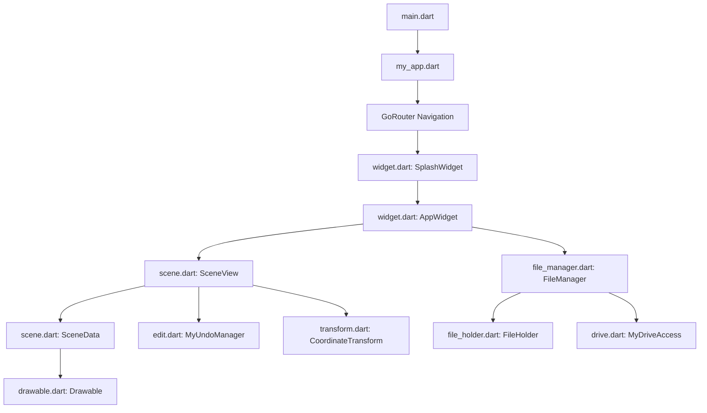

# GEMINI.md - Developer Guide for Spacetime Drawing Tool

Welcome! This guide is designed to help future LLM agents and human developers
get up to speed quickly on the **Spacetime** Flutter application.

Build Version v6.0.1+2

---

## 1. Project Purpose & Features

The Spacetime Drawing Tool is an interactive, cross-platform (Web and Android)
application used to teach and visualize special relativity in 1 space dimension
($x$) and 1 time dimension ($t$).

### Key Features

* **Relativistic Transformations**: Visualize spacetime coordinates under
  different physical assumptions:

  * **Lorentz (Relativity)**: Constant speed of light ($c$) in all reference
    frames.

  * **Ether**: Speed of light is relative to a preferred global frame.

  * **Emitter Speed**: Speed of light is relative to its source emitter.

* **Interactive Spacetime Diagram**: View worldlines, events, light cones, and
  planes of simultaneity.

* **Observer View (Side View)**: A split-screen panel showing what the observer
  sees at the current instant of time, illustrating length contraction, time
  dilation, and the relativity of simultaneity.

* **File Management**: Save/load scenes as JSON locally (files/clipboard) or
  synced to Google Drive.

* **Backward Compatibility**: Fully compatible with file saves from an older
  JavaScript version of the tool.

* **Undo/Redo & Unsaved State Sync**: History tracking of edits, object
  additions, colors, name changes, and movements synchronized with file save
  checkpoints and unsaved state warnings.

---

## 2. Codebase Architecture



### Core Components

* **`lib/main.dart`**: Entrypoint. Initializes Flutter and runs
  `MyApp.fullApp()`.

* **`lib/my_app.dart`**: Sets up global theme, JS interop, routes (via
  `GoRouter`), and serves top-level screens.

* **`lib/widget.dart`**:

  * [SplashWidget](lib/widget.dart#L38):
    Wraps loading states (settings, sprites, file initialization).

  * [AppWidget](lib/widget.dart#L218):
    Primary editor interface. Contains App Bar, toolbar, and layout columns,
    wrapped in `PopScope` to intercept back gestures when unsaved edits exist.

  * Splitscreen (`SplitterWidget`): Renders main canvas (`ScenePainter`) on top
    and observer view (`SideViewPainter`) on the bottom.

  * Sliders (`MySlider.buildTable`): Handles interactive sliders for changing
    current observer time ($t$) and velocity ($v$).

* **`lib/scene.dart`**:

  * [SceneData](lib/scene.dart#L37):
    Serialized document state (list of drawables, time, velocity, viewport
    center/zoom).

  * [SceneView](lib/scene.dart#L201):
    High-level state manager for the active editor. Coordinates painting,
    selections, tool choices, and contains a `Worker` to dispatch asynchronous
    drawable calculations.

* **`lib/transform.dart`**:

  * Coordinate math. Models `Point`, `Vector`, `ReferenceFrame` (defining
    velocity $v$ and Lorentz gamma $\gamma = 1 / \sqrt{1 - v^2}$), and
    `CoordinateTransform` which handles scaling, zooming, panning, and
    conversions between World, Observer, and Screen coordinate spaces.

* **`lib/drawable.dart`**:

  * Models entity types placed in spacetime (inheriting from `Drawable`):

    * [Event](lib/drawable.dart#L274):
      A single coordinate point. Fades out in side view over time.

    * [LightCone](lib/drawable.dart#L342):
      Expands outward along light paths.

    * [Instant](lib/drawable.dart#L434):
      Tilted plane of simultaneity.

    * [Location](lib/drawable.dart#L546):
      Moving entities (Person, Train, Barn, Flag, Clock) represented by
      worldlines. These render as length-contracted sprites in the side view.

* **`lib/file_manager.dart`**:

  * Manages active `FileHolder`, dirty/unsaved states, recent files list, and
    triggers `checkSave` dialogs for destructive file actions.

* **`lib/file_holder.dart`**:

  * Interface representing a storage driver. Concrete implementations:

    * `DriveHolder`: Google Drive file.

    * `JsonHolder`: Plain text JSON.

    * `ClipboardHolder`: Copy/paste integration (plain JSON or encoded URLs).

    * `LocalFileHolder`: Picked local files.

* **`lib/drive.dart`**:

  * Integration with Google Drive API v3. Uses `google_sign_in` and
    `extension_google_sign_in_as_googleapis_auth` to authenticate and
    list/load/save files.

* **`lib/edit.dart`**:

  * Core undo/redo infrastructure (`MyUndoManager`, `UndoCallback`, `Change`).
    Tracks saved checkpoint indices to automatically clear `unsaved` state
    when undoing back to a clean save point.

---

## 3. Math & Physics Conventions

Coordinate conversions are implemented in `lib/transform.dart`. Special
relativity math is defined by:

* Speed of light $c = 1.0$.

* Relative velocity $v$ ranges within $[-0.999, 0.999]$.

* Lorentz factor $\gamma = \frac{1}{\sqrt{1 - v^2}}$.

### Lorentz Frame Transform (World Frame $\leftrightarrow$ Reference Frame)

Transform from observer frame to world frame:

$$x_0 = \gamma (x + v t)$$

$$t_0 = \gamma (t + v x)$$

Transform from world frame to observer frame:

$$x = \gamma (x_0 - v t_0)$$

$$t = \gamma (t_0 - v x_0)$$

In code (see [Point.toFrame](lib/transform.dart#L49)):

```dart
double x0 = frame.gamma * (x - frame.velocity * t);
double t0 = frame.gamma * (t - frame.velocity * x);
```

### Length Contraction

For `Location` entities, visual width in the side view is length-contracted
based on relative velocity to the observer (see
[Location.update](lib/drawable.dart#L565)):

```dart
double v = frame.velocity;
double u = transform.frame.velocity;
double w = (v - u) / (1.0 - u * v); // Relative velocity addition formula
double gammaInv = math.sqrt(1.0 - w * w);
contracted_width = width * gammaInv;
```

---

## 4. Key Workflows

### Loading a Scene

1. `FileManager.loadFile()` is called with a `FileHolder`.

2. Navigation url is updated via `go_router`.

3. `FileManager.reload()` asynchronously loads raw JSON string via
   `FileHolder.loadData()`.

4. `SceneData.fromJsonString()` parses content, detecting modern or legacy
   schema.

5. A new `SceneView` is created, and `SplashWidget` switches to rendering
   `AppWidget`.

### Modifying and Repainting

1. User adjusts a slider or clicks/drags.

2. Changes to velocity trigger `SceneView.updateScene()`.

3. The `Worker` executes asynchronously to update all drawables (computing
   their coordinates in the observer frame).

4. `SceneView.requestRepaintScene()` is called, incrementing `repaint_counter`.

5. CustomPainters (`ScenePainter` and `SideViewPainter`) listen to
   `repaint_counter` and trigger canvas repaints.

---

## 5. Development Checklist & Gotchas

* **Asynchronous Repaints**: Repainting uses a `Worker` class
  (`lib/worker.dart`) to avoid blocking UI during frame updates. Do not call
  `setState()` directly for heavy calculations; use `updateScene()`.

* **State Syncing**: `AppWidget` uses multiple `ValueNotifier` and
  `ListNotifier` instances. When adding new settings, remember to register them
  in `Settings` so they are saved to `SharedPreferences`.

* **Deep Links**: When launching from deep links (e.g.
  `spacetime.gchouse.org/#/scene?json=...`), `FileManager` handles
  `checkNavigation` during `GoRouter` updates.

* **Test Isolation**: Integration tests in `test/` mock file loading and
  settings using wrappers. Ensure you clean up listeners in `dispose()` methods
  to prevent test leakage.

* **Remote Logging**: `RemoteLogger` (in `lib/printer.dart`) sends HTTP logs to
  a local logging server when running on web (controlled via `remote_logging`
  setting). Start logging server by running:

  ```bash
  python3 log_server.py
  ```

  This server runs on port 5001 and writes client logs to `client_logs.log` and
  standard output.

* **Drive Auth & Token Invalidation**: `MyDriveAccess` (`lib/drive.dart`)
  clears cached credentials on sign-in if Drive scopes are missing, and
  automatically clears tokens and demotes status to `LoggedIn` upon
  encountering 401, 403, or `invalid_token` API errors.

* **Drive File Search & Query Parsing**: `DriveState` (`lib/drive.dart`) has
  a search input (`ValueKey('drive-search-input')`) persisting across dialog
  opens in a session. `buildDriveQuery()` converts title terms into
  `name contains '...'` clauses, maps `owner:me` / `owner:email` into
  `'me' in owners`, and supports raw Google Drive API query expressions.

* **Title & Metadata Sync**: `SceneData.title` and `SceneData.description`
  remain synchronized with `FileHolder.title` and Google Drive file metadata
  (`request.name`, `request.description`, `request.mimeType`). Opening a
  `DriveHolder` overrides the title stored in JSON with the Drive file name.

* **Web Asset Cache-Busting & Help Reloading**: Web assets are requested with
  version tags (`?v=$versionTag`). `HelpScreen` (`lib/help.dart`) scans loaded
  help HTML for version headers (`v2.1.0+XX`). If a stale version string
  is detected, it issues a forced `no-cache` fetch to reload the asset.

* **Mouse Drag Viewport Jump Prevention**: Single-pointer panning and object
  moving in `lib/mouse.dart` initialize focal points at gesture start without
  applying an initial frame-1 movement jump. Movement deltas are computed
  dynamically during `onScaleUpdate`.

* **Unsaved State & Undo Checkpoint Sync**: `MyUndoManager` tracks a
  `_saved_index`. When undoing back to the last save point, `unsaved.value` is
  automatically set to `false`. Navigating to auxiliary screens (`/help`,
  `/about`, `/settings`) preserves the active drawing in memory without
  prompting. Web `beforeunload` interop (`web/extra_js_interface.js`) prompts a
  browser leave-site warning when `unsaved` is true.

* **JSON Error Recovery & Syntax Editor**: `FileManager` retains `rawBlob` on
  parse failures and provides `loadFromRawJson(String rawJson)`. `SplashWidget`
  displays an "Edit JSON Syntax" button launching `JsonSyntaxEditorDialog` for
  live syntax correction and inline validation.

* **Theme Palette Synchronization**: `SavableColorArray.updateTheme` duplicates
  color schemes with `List.from(...)` to prevent in-place mutation of static
  defaults. `AppWidgetState` listens to `widget.settings.statusStream()`
  to trigger canvas repaints and WebView theme class toggles
  (`light-theme`/`dark-theme`).

* **Settings Layout & Responsive Reflow**: `SettingsScreen`
  (`lib/settings.dart`) uses `Wrap` widgets with constrained input width
  controls (`SizedBox`) to prevent horizontal `RenderFlex` overflows on narrow
  mobile screens. `MyIterator` dynamically filters out empty widget sublists
  produced by hidden `debug_only` settings or `EndOfRow` breaks, preventing
  empty rows and phantom dividers.

* **Viewport Bounds & Initial Scale**: `CoordinateTransform`
  (`lib/transform.dart`) defaults to `zoom = 100.0` pixels per world unit with
  origin centered at `(width / 2, height / 2)`. Screen range bounds ($x$ and
  $t$) are derived dynamically from container size passed during `LayoutBuilder`
  `resize()` calls in `SceneView.build` (`lib/scene.dart`).

---

## 6. Code Style

### Markdown Preferences

To maintain clean and standardized documentation for both developers and
automated builders (such as `pandoc`):

* Keep line lengths less than 80 characters.

* Always follow headers with a blank line.

* Surround all list items and code blocks with blank lines.

### Dart Preferences

To ensure clean and standard Dart syntax across the project:

* After editing or creating any Dart files, format the code by executing:

  ```bash
  dart format .
  ```

### Git Commit Preferences

To ensure clean and standard commit logs:

* Write commit messages using the following structure:

  ```text
  Version $version. <major fixes>

  <description of minor and major fixes>
  ```

* Keep line lengths in commit messages under 70 characters.

---

## 7. Testing Guidelines

To maintain fast feedback loops, run targeted tests depending on which files
are modified. Only run the entire test suite (`flutter test`) before doing a
git commit or staging a release.

*   **Name Validation** (`lib/name.dart`)

    Run: `flutter test test/name_test.dart`

*   **Routing & Navigation** (`lib/navigation.dart`, `lib/my_app.dart`)

    Run: `flutter test test/nav_test.dart`

*   **Upload & Clipboard** (`lib/upload.dart`)

    Run: `flutter test test/upload_test.dart`

*   **JSON & Scene Serialization** (`lib/scene.dart`)

    Run: `flutter test test/json_test.dart`

*   **Coordinate Math** (`lib/transform.dart`)

    Run: `flutter test test/transform_test.dart`

*   **Relativity Physics Correctness**
    (`lib/transform.dart`, `lib/drawable.dart`)

    Run: `flutter test test/relativity_test.dart`

*   **Spacetime Entities / Drawables** (`lib/drawable.dart`)

    Run: `flutter test test/simple_test.dart test/scene_editor.dart`

*   **Undo/Redo History & Unsaved Sync** (`lib/edit.dart`)

    Run: `flutter test test/edit_test.dart`

*   **File IO & Recent Files**
    (`lib/file_manager.dart`, `lib/file_holder.dart`,
    `lib/local_file.dart`, `lib/recent_file.dart`)

    Run: `flutter test test/local_file_test.dart`

*   **Drive Authentication & Token Caching** (`lib/drive.dart`)

    Run: `flutter test test/drive_cache_test.dart`

*   **Mouse Clicks & Drags** (`lib/mouse.dart`)

    Run: `flutter test test/mouse_test.dart`

*   **Velocity & Time Sliders** (`lib/slider.dart`)

    Run: `flutter test test/slider_test.dart`

*   **Settings Management** (`lib/settings.dart`)

    Run: `flutter test test/settings_test.dart`

*   **Background Worker** (`lib/worker.dart`)

    Run: `flutter test test/worker_test.dart`

*   **Interactive Scripts / Lessons** (`lib/script.dart`)

    Run: `flutter test test/script_test.dart`

*   **Async Animation Helpers** (`lib/animate.dart`)

    Run: `flutter test test/async_test.dart`

*   **General UI / Layout** (`lib/widget.dart`)

    Run: `flutter test test/widget_test.dart test/layout_test.dart`

<script src="https://cdn.jsdelivr.net/npm/mermaid/dist/mermaid.min.js"></script>
<script>
  mermaid.initialize({ startOnLoad: true, theme: 'default' });
</script>
